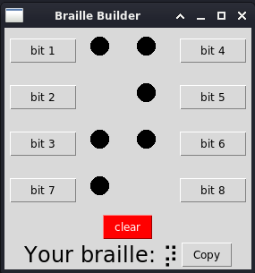

# Braille art transformations

The braille utf-8 characters (⣿) are commonly used to draw images in text form.
This repository is to explore the subject.

The [braille character range](https://www.unicode.org/charts/PDF/U2800.pdf)
is between U+2800 and U+28FF.

It is defined as a 2x4 dot matrix,
which makes it suitable to be treated as an abstraction for pixels.
This is the reason it is highly utalized for utf art.

Common braille dialects only use a 2x3 matrix.
What unicode has is the so called "Eight-dot braille" variation.

## Encoding
Logically enough,
every significant bit corresponst to a single dot of the character.
However, the first 6 bits poss priority

| bit | char mask |
| :---: | :---: |
| 0b00000001 | ⠁ |
| 0b00000010 | ⠂ |
| 0b0000010  | ⠄ |
| 0b0000100  | ⠈ |
| 0b0001000  | ⠐ |
| 0b0010000  | ⠠ |
| 0b0100000  | ⡀ |
| 0b1000000  | ⢀ |

As the above implies,
there is also a blank character (`⠀`) for all character masks off,
which is quite easy to mistake for a normal space.

## Transformations

### Inversion
Inverting a braille pattern ('⢷' -> '⡈') can be expressed as:
```perl
    $BASE + ($TOP - $codepoint)
    where
        BASE is the start of the range (0x2800)
        TOP is the end of the range (0x28FF)
        and codepoint is the braille character to invert question
```

### Mirroring/flipping
Mirroring a braille pattern ('⢪' -> '⡕') can be expressed as
rotating bits 1-4 and 5-6 with their respective half widths.
This is easiest if said bits a separated, rotated,
logical OR'ed and the base (0x2800) is added back.

> [!NOTE]
> "Rotating" in the sense as defined by x86.
> Since we are rotating by half the bit range lenght widths,
> the direction is irrelevant.
> Both left and right rotation will yield the same result.

## Implementation
The repository contains a
[Perl implementation to the afore mentioned operations](braille-art.pl).

Here is a copy of the help message:

    ./braille-art.pl <verb>
        table  - print braille/inverted/flipped table
        invert - perform inversion on stdin
        flip   - perform mirroring on stdin (both line and character wise)

Here is an example of its usage:
```sh
$ cat chad.utf
⠀⠀⠀⠀⠀⠀⠀⠀⠀⠀⠀⢀⣀⣀⣀⣀⣀⡀⠀⠀⠀⠀⠀⠀⠀⠀⠀⠀⠀⠀
⠀⠀⠀⠀⠀⣀⣠⣤⣶⣞⡛⠿⠭⣷⡦⢬⣟⣿⣿⣷⣦⡀⠀⠀⠀⠀⠀⠀⠀⠀
⠀⠀⠀⢠⡾⣯⡙⠳⣍⠳⢍⡙⠲⠤⣍⠓⠦⣝⣮⣉⠻⣿⡄⠀⠀⠀⠀⠀⠀⠀
⠀⠀⠀⡿⢿⣷⣯⣷⣮⣿⣶⣽⠷⠶⠬⠿⠷⠟⠻⠟⠳⠿⢷⡀⠀⠀⠀⠀⠀⠀
⠀⠀⣸⣁⣀⣈⣛⣷⠀⢹⠀⠀⠀⠀⠀⠀⠀⠀⠀⠀⠀⠀⠈⢧⠀⠀⠀⠀⠀⠀
⠀⣸⣯⣁⣤⣤⣀⠈⢧⠘⣆⢀⣠⠤⣄⠀⠀⠀⠀⠀⠀⠀⠀⠘⡇⠀⠀⠀⠀⠀
⠀⢙⡟⡛⣿⣿⣿⢷⡾⠀⢿⣿⣏⣳⣾⡆⠀⠀⠀⠀⠀⠀⠀⠀⡇⠀⠀⠀⠀⠀
⢀⡞⠸⠀⠉⠉⠁⠀⠀⣠⣼⣿⣿⠀⣽⡇⠀⠀⠀⠀⠀⠀⠀⡼⠁⠀⠀⠀⠀⠀
⣼⡀⣀⡐⢦⢀⣀⠀⣴⣿⣿⡏⢿⣶⣟⣀⣀⣀⣀⣀⣤⣤⠞⠁⠀⠀⠀⠀⠀⠀
⠀⣿⣿⣿⣿⣾⣿⣿⣿⣾⡻⠷⣝⣿⡌⠉⠉⠁⠀⠀⣸⠁⠀⠀⠀⠀⠀⠀⠀⠀
⠀⠈⢻⣿⣿⣿⣿⡟⣿⣟⠻⣿⡿⢿⡇⠀⠀⠀⠀⠀⢹⠀⠀⠀⠀⠀⠀⠀⠀⠀
⠀⢠⣿⢿⣼⣿⣿⠿⣏⣹⡃⢹⣯⡿⠀⠀⠀⠀⠀⠀⠈⢧⠀⠀⠀⠀⠀⠀⠀⠀
⠀⣽⣿⣿⢿⠹⣿⣇⠿⣾⣷⣼⠟⠁⠀⠀⠀⢀⣠⣴⣶⣾⣷⣶⣄⡀⠀⠀⠀⠀
⠀⢿⣾⡟⢺⣧⣏⣿⡷⢻⠅⠀⠀⠀⢀⣠⣶⣿⣿⣿⣿⣿⣿⣿⣿⣿⣷⣄⡀⠀
⠀⠀⠙⠛⠓⠛⠋⣡⣿⣬⣤⣤⣶⣿⣿⣿⣿⣿⣿⣿⣿⣿⣿⣿⣿⣿⠿⠟⠛⠛
⠀⠀⠀⠀⠀⠀⢰⣿⣿⣿⣿⣿⣿⣿⣿⣿⣿⣿⣿⠿⠟⠋⠉⠁⠀⠀⠀⠀⠀⠀
⠀⠀⠀⠀⠀⠀⠸⡿⠿⠿⠿⠿⠿⠿⠟⠛⠋⠁⠀⠀⠀⠀⠀⠀⠀⠀⠀⠀⠀⠀
$ cat chad.utf | braille-art.pl invert
⣿⣿⣿⣿⣿⣿⣿⣿⣿⣿⣿⡿⠿⠿⠿⠿⠿⢿⣿⣿⣿⣿⣿⣿⣿⣿⣿⣿⣿⣿
⣿⣿⣿⣿⣿⠿⠟⠛⠉⠡⢤⣀⣒⠈⢙⡓⠠⠀⠀⠈⠙⢿⣿⣿⣿⣿⣿⣿⣿⣿
⣿⣿⣿⡟⢁⠐⢦⣌⠲⣌⡲⢦⣍⣛⠲⣬⣙⠢⠑⠶⣄⠀⢻⣿⣿⣿⣿⣿⣿⣿
⣿⣿⣿⢀⡀⠈⠐⠈⠑⠀⠉⠂⣈⣉⣓⣀⣈⣠⣄⣠⣌⣀⡈⢿⣿⣿⣿⣿⣿⣿
⣿⣿⠇⠾⠿⠷⠤⠈⣿⡆⣿⣿⣿⣿⣿⣿⣿⣿⣿⣿⣿⣿⣷⡘⣿⣿⣿⣿⣿⣿
⣿⠇⠐⠾⠛⠛⠿⣷⡘⣧⠹⡿⠟⣛⠻⣿⣿⣿⣿⣿⣿⣿⣿⣧⢸⣿⣿⣿⣿⣿
⣿⡦⢠⢤⠀⠀⠀⡈⢁⣿⡀⠀⠰⠌⠁⢹⣿⣿⣿⣿⣿⣿⣿⣿⢸⣿⣿⣿⣿⣿
⡿⢡⣇⣿⣶⣶⣾⣿⣿⠟⠃⠀⠀⣿⠂⢸⣿⣿⣿⣿⣿⣿⣿⢃⣾⣿⣿⣿⣿⣿
⠃⢿⠿⢯⡙⡿⠿⣿⠋⠀⠀⢰⡀⠉⠠⠿⠿⠿⠿⠿⠛⠛⣡⣾⣿⣿⣿⣿⣿⣿
⣿⠀⠀⠀⠀⠁⠀⠀⠀⠁⢄⣈⠢⠀⢳⣶⣶⣾⣿⣿⠇⣾⣿⣿⣿⣿⣿⣿⣿⣿
⣿⣷⡄⠀⠀⠀⠀⢠⠀⠠⣄⠀⢀⡀⢸⣿⣿⣿⣿⣿⡆⣿⣿⣿⣿⣿⣿⣿⣿⣿
⣿⡟⠀⡀⠃⠀⠀⣀⠰⠆⢼⡆⠐⢀⣿⣿⣿⣿⣿⣿⣷⡘⣿⣿⣿⣿⣿⣿⣿⣿
⣿⠂⠀⠀⡀⣆⠀⠸⣀⠁⠈⠃⣠⣾⣿⣿⣿⡿⠟⠋⠉⠁⠈⠉⠻⢿⣿⣿⣿⣿
⣿⡀⠁⢠⡅⠘⠰⠀⢈⡄⣺⣿⣿⣿⡿⠟⠉⠀⠀⠀⠀⠀⠀⠀⠀⠀⠈⠻⢿⣿
⣿⣿⣦⣤⣬⣤⣴⠞⠀⠓⠛⠛⠉⠀⠀⠀⠀⠀⠀⠀⠀⠀⠀⠀⠀⠀⣀⣠⣤⣤
⣿⣿⣿⣿⣿⣿⡏⠀⠀⠀⠀⠀⠀⠀⠀⠀⠀⠀⠀⣀⣠⣴⣶⣾⣿⣿⣿⣿⣿⣿
⣿⣿⣿⣿⣿⣿⣇⢀⣀⣀⣀⣀⣀⣀⣠⣤⣴⣾⣿⣿⣿⣿⣿⣿⣿⣿⣿⣿⣿⣿
$ cat chad.utf | braille-art.pl flip
⠀⠀⠀⠀⠀⠀⠀⠀⠀⠀⠀⠀⢀⣀⣀⣀⣀⣀⡀⠀⠀⠀⠀⠀⠀⠀⠀⠀⠀⠀
⠀⠀⠀⠀⠀⠀⠀⠀⢀⣴⣾⣿⣿⣻⡥⢴⣾⠭⠿⢛⣳⣶⣤⣄⣀⠀⠀⠀⠀⠀
⠀⠀⠀⠀⠀⠀⠀⢠⣿⠟⣉⣵⣫⠴⠚⣩⠤⠖⢋⡩⠞⣩⠞⢋⣽⢷⡄⠀⠀⠀
⠀⠀⠀⠀⠀⠀⢀⡾⠿⠞⠻⠟⠻⠾⠿⠥⠶⠾⣯⣶⣿⣵⣾⣽⣾⡿⢿⠀⠀⠀
⠀⠀⠀⠀⠀⠀⡼⠁⠀⠀⠀⠀⠀⠀⠀⠀⠀⠀⠀⠀⡏⠀⣾⣛⣁⣀⣈⣇⠀⠀
⠀⠀⠀⠀⠀⢸⠃⠀⠀⠀⠀⠀⠀⠀⠀⣠⠤⣄⡀⣰⠃⡼⠁⣀⣤⣤⣈⣽⣇⠀
⠀⠀⠀⠀⠀⢸⠀⠀⠀⠀⠀⠀⠀⠀⢰⣷⣞⣹⣿⡿⠀⢷⡾⣿⣿⣿⢛⢻⡋⠀
⠀⠀⠀⠀⠀⠈⢧⠀⠀⠀⠀⠀⠀⠀⢸⣯⠀⣿⣿⣧⣄⠀⠀⠈⠉⠉⠀⠇⢳⡀
⠀⠀⠀⠀⠀⠀⠈⠳⣤⣤⣀⣀⣀⣀⣀⣻⣶⡿⢹⣿⣿⣦⠀⣀⡀⡴⢂⣀⢀⣧
⠀⠀⠀⠀⠀⠀⠀⠀⠈⣇⠀⠀⠈⠉⠉⢡⣿⣫⠾⢟⣷⣿⣿⣿⣷⣿⣿⣿⣿⠀
⠀⠀⠀⠀⠀⠀⠀⠀⠀⡏⠀⠀⠀⠀⠀⢸⡿⢿⣿⠟⣻⣿⢻⣿⣿⣿⣿⡟⠁⠀
⠀⠀⠀⠀⠀⠀⠀⠀⡼⠁⠀⠀⠀⠀⠀⠀⢿⣽⡏⢘⣏⣹⠿⣿⣿⣧⡿⣿⡄⠀
⠀⠀⠀⠀⢀⣠⣶⣾⣷⣶⣦⣄⡀⠀⠀⠀⠈⠻⣧⣾⣷⠿⣸⣿⠏⡿⣿⣿⣯⠀
⠀⢀⣠⣾⣿⣿⣿⣿⣿⣿⣿⣿⣿⣶⣄⡀⠀⠀⠀⠨⡟⢾⣿⣹⣼⡗⢻⣷⡿⠀
⠛⠛⠻⠿⣿⣿⣿⣿⣿⣿⣿⣿⣿⣿⣿⣿⣿⣶⣤⣤⣥⣿⣌⠙⠛⠚⠛⠋⠀⠀
⠀⠀⠀⠀⠀⠀⠈⠉⠙⠻⠿⣿⣿⣿⣿⣿⣿⣿⣿⣿⣿⣿⣿⡆⠀⠀⠀⠀⠀⠀
⠀⠀⠀⠀⠀⠀⠀⠀⠀⠀⠀⠀⠈⠙⠛⠻⠿⠿⠿⠿⠿⠿⢿⠇⠀⠀⠀⠀⠀⠀

```

## Builder
There is also a [builder Tcl/Tk GUI](braille-builder.tcl) included in this repo.
This is how it looks:


As you toggle the dots,
it automatically updates your clipboard.
